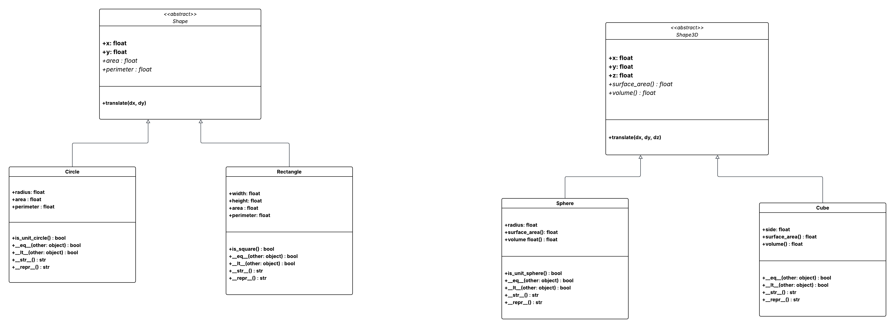

# Labbar – Programmering (DE25)

Struktur för **lab_1** och **lab_2** i kursen Programmering (Data Engineer 2025).  
Kod körs som `.py` (ingen Jupyter). Virtuell miljö `.venv` används för renare paketversioner.

## Innehåll
- [Syfte](#syfte)
- [Miljö & versioner](#miljö--versioner)
- [Snabbstart](#snabbstart)
- [Struktur](#struktur)
- [Körning](#körning)
- [Exempeloutput](#exempeloutput)

## Syfte
- En mapp per lab, kod i `.py`.
- Tydlig data-/plots-/tests-struktur.
- Enkelt att klona och köra.
- Källor/anteckningar i `lab_X/notes.md`.

## Miljö & versioner
- **Python:** 3.12+ (Testad på 3.13.5)
- **Paket:** se `requirements.txt` (genereras med `pip freeze`).  
- VS Code pekar på `.venv` via `.vscode/settings.json`.

## Snabbstart
**Windows (PowerShell):**
```powershell
py -m venv .venv
.\.venv\Scripts\Activate.ps1
python -m pip install --upgrade pip
python -m pip install -r requirements.txt
```

## Struktur
- `lab_1/` och `lab_2/` ligger i separata mappar i repot.
- Varje labb-mapp innehåller:
  - `data/` med relevanta filer (t.ex. `dna_raw.txt`, PDF med uppgiftstext).
  - Python-skript (`.py`) som löser uppgifterna.
  - `notes.md` med källor och vad jag fått hjälp med (radintervall + länk).
- Kod körs som `.py` (ingen Jupyter).

# Körning lab 1 - FASTA-parsing
### Task 1 (script + plottar)
python lab_1/task_1_lab.py
### Task 2 (funktion + plottar)
python lab_1/task_2_lab.py

**Exempeloutput (task_2, dna_raw_complicated.txt)**
```bash
seq1 {'a': 17, 't': 7, 'c': 8, 'g': 2} (Others: 0)
seq2 {'a': 3,  't': 7, 'c': 4, 'g':10} (Others: 0)
seq3 {'a':36, 't':19, 'c':34, 'g':21} (Others: 2)
seq4 {'a':17, 't':12, 'c':15, 'g':20} (Others: 0)
```


# Lab 2 – Geometry OOP (2D + bonus 3D)

[](lab_2/lab_2_uml.png)


Abstrakta basklasser för 2D/3D, arv till Circle/Rectangle och Sphere/Cube, 
validering, jämförelse med `@total_ordering`, en OOP-plotter för 2D, 
samt enhetstester med pytest.

### Miljö
```bash
python -m venv .venv
.\.venv\Scripts\Activate.ps1   # Windows
python -m pip install --upgrade pip
pip install -r requirements.txt
```

## Struktur lab_2/
- lab_2/
  - circle.py        # 2D: area/perimeter, eq/lt, is_unit_circle
  - rectangle.py     # 2D: area/perimeter, eq/lt, is_square
  - shape.py         # abstrakt 2D-bas: x,y, translate(), @property area/perimeter
  - sphere.py        # 3D: surface_area/volume, eq/lt, is_unit_sphere
  - cube.py          # 3D: surface_area/volume, eq/lt
  - shape3d.py       # abstrakt 3D-bas: x,y,z, translate(), @property volume/surface_area
  - plotter.py       # Shape2dPlotter: ritar flera 2D-former i samma axes
  - plots/
    - lab_2_plot.png # exempelbild (genererad av plotter.py)
  - tests/
    - test_shapes2d.py
    - test_shapes3d.py
  - lab_2_uml.png

## Körning lab 2
Kör tester:
```bash
pytest -q

python lab_2/plotter.py
# sparar: lab_2/plots/lab_2_plot.png
```